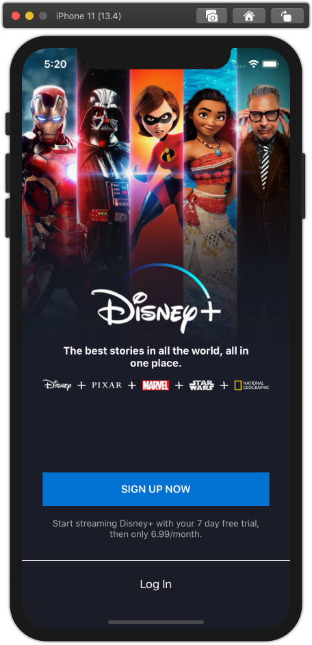
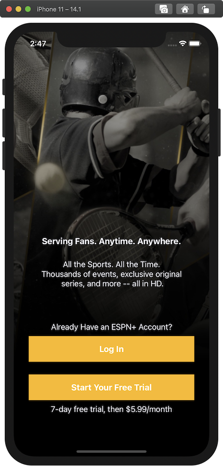

# Designing a Paywall System

A paywall is a screen that is presented to users to sell them access to our content. Our product team wants to be able to make updates to the content, layout, and product offerings of our paywalls *without making new releases of our apps*. Your goal is to implement a system that will let them render the paywalls of their dreams.

## Product Requirements
- Your paywall system should have the capacity to render *at least* the layouts for the following two example paywalls:

Disney+ | ESPN+
---- | ----
 | 

  - We are providing you with the image assets that you see in the paywall images above. Those assets are optimized for an iPhone 11. Your Paywall should render on all iOS devices, but we will be evaluating how it looks on an iPhone 11.
- Your paywall should handle user input (tapping the buttons).
  - When a user taps one of the log in buttons, your application should present an alert with the message: `"Log In"`
  - When a user taps one of the purchase buttons, your application should present an alert with the message: `"Purchase: \(sku)"`
    - The SKU, a string that represents the asset being purchased, should be remotely configurable. For Disney+ use the SKU: `dplus_free_trial` and for ESPN+ use the SKU: `eplus_free_trial`.
- You should be able to render both paywall screens without restarting the app. The flow should work like this:
	- Start the [server](#serving-the-paywalls) to serve the Disney paywall: `sh scripts/serve.sh disney`
	- Run the application
	- See the Disney paywall
	- Kill the server
  - Restart the server to serve the ESPN paywall: `sh scripts/serve.sh espn`
	- Shake the device
	- See the ESPN paywall
  - *Note*: Make sure that your URLRequest to fetch the json ignores the cache to avoid seeing stale data in the paywalls. We have provided `URLSession.paywall` for you as one option for achieving this.
- Your screen should render using native UIKit or SwiftUI components (i.e not a webview)

## Xcode Project

- We have provided an Xcode project to get you started. Nothing in the starter template is designed to limit your choices. You are encouraged to change any and all of the template code. It is *not* required that you use this template. If you prefer to set up your own project from scratch, please do so.
- The starter project has code set up to handle the shake gesture, disable ATS, and ignore cached responses during networking. We hope this makes it a little bit easier for you to get started quickly.
- You should feel free to submit a solution using UIKit or SwiftUI. In the starter template we provide boilerplate for either approach. In the `SceneDelegate` you can switch between the two by changing the `useUIKit` constant, but you can also choose to delete the code for the UI framework you decide not to use.
- If you decide to make a brand new Xcode project, be sure to add the `/scripts` folder and `README.md` to the project so that we can easily read your json files and README.

## Submission Requirements
- Use git to make commits while you work
- There is a [README](./README.md) template with questions for you to answer about your submission.
- You should submit a zip folder with your entire git repository

## Timing
- We want to respect your time and we ask that you please try to spend around 2 hours to complete your submission.  You will not be penalized if you spend more or less time on this project.
- We are more interested in seeing you write good, clear code than in seeing you "finish" the exercise.
- Focus on the requirements you think are the most important. Document the unfinished parts of your project in the README.
- We *will* review your code.
- This submission, as well as your phone screen and resume will be used to determine if you should move forward to an on-site interview.
- We understand that 2 hours is probably not enough time to finish the requirements laid out in this document. If you are extended an on-site interview, the first phase of the interview will be a pair-programming exercise to complete them. You can expect this code to be discussed and expanded on during the interview.

## Serving the Paywalls

We've provided a script to get a file server running [here](./scripts/serve.sh). This script requires python (version 2 comes installed on your mac but the script supports version 2 or 3).

If you prefer to run some other file server feel free to do so, but the point is that you can serve either the `scripts/espn` or `scripts/disney` folders at `localhost:8000`. To run the script, just call `sh serve.sh disney` or `sh serve.sh espn` which will serve either the disney or espn folders.
