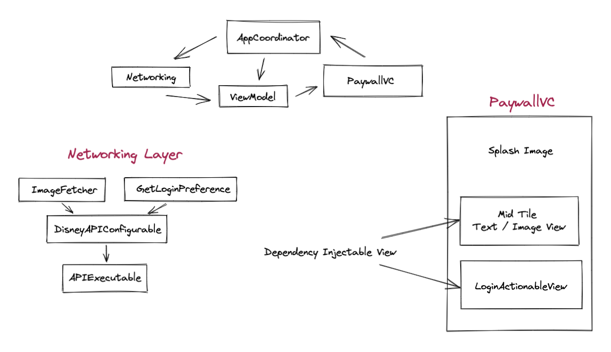

#  DSS Take Home

Repository for the Disney Streaming Services Take Home Interview.

[Check out the prompt](./PROMPT.md)

## App Demo

## App Architecture Diagram

## README Questions:

##### 1. Describe any important assumptions that you have made in your code.
- One of the assumption I made is that sever already know user's device UUID and their account. When we make a request to get device theme we pass device's UUID to get user's favorite theme.
- Base on the two sample layout. I assume other layouts are similar that consist of _splash Image_, _Middle Tile_ and a section for _login_ and _free trial_ button

##### 2. What edge cases have you considered in your code? What edge cases have you yet to handle?
- One of the case that I covered is that you're able to mix and match _splash image_, _mid tile_, and _login/register_ in any combination we like.
- I haven't figure out the correct way to handle different image size to look exactly like the mock image. 

##### 3. What are some things you would like to do if you had more time? Is there anything you would have to change about the design of your current code to do these things? Give a rough outline of how you might implement these ideas.
- The way how the project is setup right now is that I have pre-defined themes and the view will render base on what user's favorite theme is. If I had more time I would implement sever driven UI, very cool concept that [Airbnb](https://medium.com/airbnb-engineering/a-deep-dive-into-airbnbs-server-driven-ui-system-842244c5f5) has been doing.

